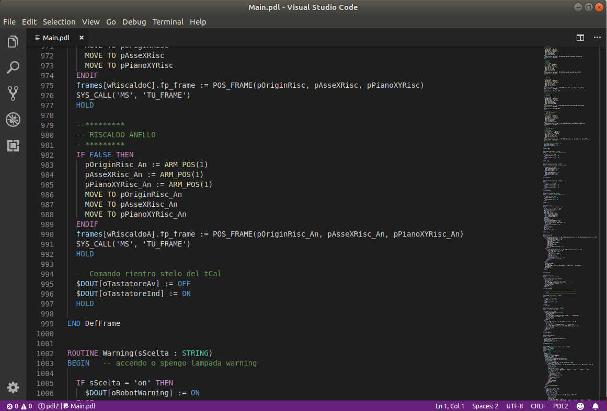
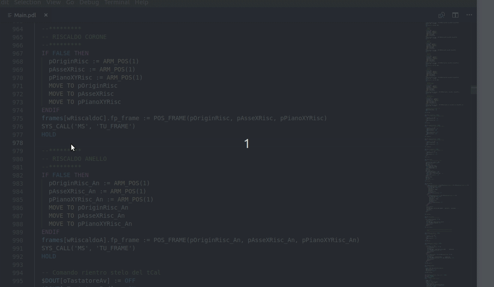

# pdl2-comau README

PDL2 Comau Robots programming language support

* [GitHub Repository](https://github.com/abedGNU/pdl2-comau.git)

## Features

Syntax highlight

Code completion
    - Control statements
    - Type definition
    

## Release Notes

### 0.0.1

Initial release

## TODO

Complete syntax highlighting, autocompletion and routine outline